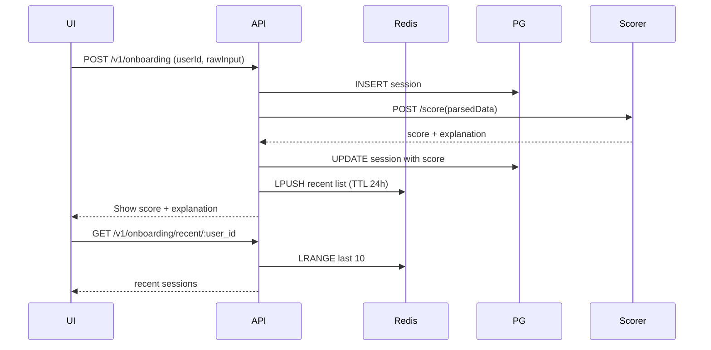

# Onboarding UI + Score Viewer

A complete React/TypeScript frontend for the modular onboarding system, built with Next.js (App Router), Tailwind CSS, and React Query. This application provides a clean interface for submitting onboarding data and viewing calculated scores and session history.

## Repository

**GitHub Repository:** https://github.com/example/onboarding-ui-score-viewer

To initialize and push this repository:

```bash
git init
git remote add origin https://github.com/example/onboarding-ui-score-viewer
git add .
git commit -m "Initial commit"
git branch -M main
git push -u origin main
```

## Architecture Overview



## Tech Stack

- **Framework:** Next.js 14 (App Router) + TypeScript
- **Styling:** Tailwind CSS
- **Data Fetching:** React Query (TanStack Query) + Axios
- **Forms:** React Hook Form + Zod validation
- **Testing:** Vitest + React Testing Library
- **Type Generation:** openapi-typescript (optional)
- **Code Quality:** ESLint + Prettier

## Prerequisites

- Node.js 18+ (or 20+)
- PNPM (recommended) or npm/yarn
- Running backend API at `http://localhost:3000` (see [modular-onboarding-scoring](https://github.com/example/modular-onboarding-scoring))

## Setup

1. **Install dependencies:**
   ```bash
   pnpm install
   # or: npm install
   # or: yarn install
   ```

2. **Copy environment configuration:**
   ```bash
   cp .env.local.example .env.local
   ```

3. **Configure environment variables in `.env.local`:**
   ```env
   NEXT_PUBLIC_API_BASE_URL=http://localhost:3000
   NEXT_PUBLIC_HARDCODED_USER_ID=7a3f8de5-2d5f-4d9a-9b33-9a1f62d9f4b2
   NEXT_PUBLIC_API_KEY=dev-api-key
   ```

4. **Optionally generate API types from Swagger:**
   ```bash
   pnpm openapi:gen
   ```

## Development

Start the development server:

```bash
pnpm dev
```

Visit [http://localhost:3000](http://localhost:3000) to view the application.

## Available Scripts

- `pnpm dev` - Start development server
- `pnpm build` - Build for production
- `pnpm start` - Start production server
- `pnpm lint` - Run ESLint
- `pnpm test` - Run tests
- `pnpm openapi:gen` - Generate API types from Swagger

## Features

### 🔍 **Onboarding Form**
- Clean, accessible form with validation
- Fields: Entity Name, Region, Category, Tags (comma-separated)
- Real-time validation with Zod schemas
- Loading states and error handling
- Mobile-first responsive design

### 📊 **Score Display**
- Prominent score card showing 0-100 score
- Detailed explanation of scoring factors
- Updates automatically after form submission
- Visual feedback for score ranges

### 📈 **Recent Sessions**
- Last 10 onboarding sessions for the user
- Shows session ID, creation date, and score
- Auto-refreshes on window focus
- Responsive grid layout

### 🎨 **UI/UX Features**
- **Accessibility:** ARIA labels, keyboard navigation, focus management
- **Responsive:** Mobile-first design with desktop enhancements
- **Performance:** React Query caching and optimistic updates
- **Error Handling:** Toast notifications and inline error messages
- **Loading States:** Skeletons and spinners throughout

## API Configuration

### Environment Variables

| Variable | Description | Default |
|----------|-------------|---------|
| `NEXT_PUBLIC_API_BASE_URL` | Backend API base URL | `http://localhost:3000` |
| `NEXT_PUBLIC_HARDCODED_USER_ID` | User ID for API calls | Required (UUID) |
| `NEXT_PUBLIC_API_KEY` | API authentication key | Optional |

### API Endpoints Used

- `POST /v1/onboarding` - Submit onboarding data
- `GET /v1/onboarding/recent/:user_id` - Fetch recent sessions

## Usage

1. **Fill out the onboarding form:**
   - Entity Name (minimum 2 characters)
   - Region (required)
   - Category (required)
   - Tags (comma-separated, optional)

2. **Submit and view score:**
   - Score appears in the score card (0-100)
   - Explanation shows scoring factors
   - Recent sessions list updates automatically

3. **View session history:**
   - Recent sessions show automatically
   - Click refresh to manually update
   - Each session shows ID, date, and score

## Type Generation

This project supports automatic API type generation from your backend's Swagger/OpenAPI documentation:

```bash
# Generate types from backend Swagger JSON
pnpm openapi:gen
```

This fetches the OpenAPI spec from `${API_BASE_URL}/docs-json` and generates TypeScript types. If generation fails, the app falls back to handwritten types in `src/lib/types.ts`.

## Testing

Run the test suite:

```bash
pnpm test
```

The test suite includes:
- Smoke tests for component rendering
- Form validation testing
- API integration mocking
- Accessibility testing

## Project Structure

```
onboarding-ui-score-viewer/
├── public/
│   └── favicon.ico
├── src/
│   ├── app/
│   │   ├── layout.tsx          # Root layout with providers
│   │   ├── page.tsx            # Main dashboard page
│   │   └── globals.css         # Global styles
│   ├── components/
│   │   ├── OnboardingForm.tsx  # Main form component
│   │   ├── ScoreCard.tsx       # Score display component
│   │   ├── RecentSessions.tsx  # Sessions list component
│   │   └── UI/                 # Reusable UI components
│   │       ├── Button.tsx
│   │       ├── Input.tsx
│   │       ├── Card.tsx
│   │       └── ...
│   ├── lib/
│   │   ├── axios.ts            # Axios configuration
│   │   ├── queryClient.ts      # React Query setup
│   │   ├── zodSchemas.ts       # Form validation schemas
│   │   ├── types.ts            # TypeScript type definitions
│   │   └── openapi/            # Generated API types
│   ├── hooks/
│   │   ├── usePostOnboarding.ts  # Form submission hook
│   │   └── useRecentSessions.ts  # Data fetching hook
│   └── tests/
│       ├── smoke.test.tsx
│       └── setupTests.ts
├── package.json
├── tsconfig.json
├── tailwind.config.ts
├── next.config.mjs
└── ...
```

## Troubleshooting

### Common Issues

**CORS Errors**
- Ensure your backend API has CORS enabled for `http://localhost:3000`
- Check the backend's CORS configuration

**Authentication Errors (401/403)**
- Verify `NEXT_PUBLIC_API_KEY` is set correctly in `.env.local`
- Ensure the API key matches your backend configuration

**API Connection Issues**
- Confirm `NEXT_PUBLIC_API_BASE_URL` points to your running backend
- Verify the backend is running on the specified port

**Type Generation Issues**
- Ensure backend is running with Swagger docs available at `/docs-json`
- Check network connectivity to the API
- Falls back to manual types if generation fails

**Build/Runtime Errors**
- Clear Next.js cache: `rm -rf .next`
- Reinstall dependencies: `rm -rf node_modules && pnpm install`
- Check TypeScript compilation: `pnpm build`

### Development Tips

- Use React Developer Tools for component debugging
- Enable React Query DevTools in development
- Check browser Network tab for API request/response debugging
- Use Tailwind CSS IntelliSense extension for better styling experience

## Contributing

1. Fork the repository
2. Create a feature branch (`git checkout -b feature/amazing-feature`)
3. Make your changes
4. Add tests if applicable
5. Ensure code passes linting (`pnpm lint`)
6. Commit your changes (`git commit -m 'Add amazing feature'`)
7. Push to the branch (`git push origin feature/amazing-feature`)
8. Open a Pull Request

## License

MIT License - see [LICENSE](LICENSE) file for details.

## Related Projects

- [Modular Onboarding + Scoring API](https://github.com/example/modular-onboarding-scoring) - Backend API and scoring service