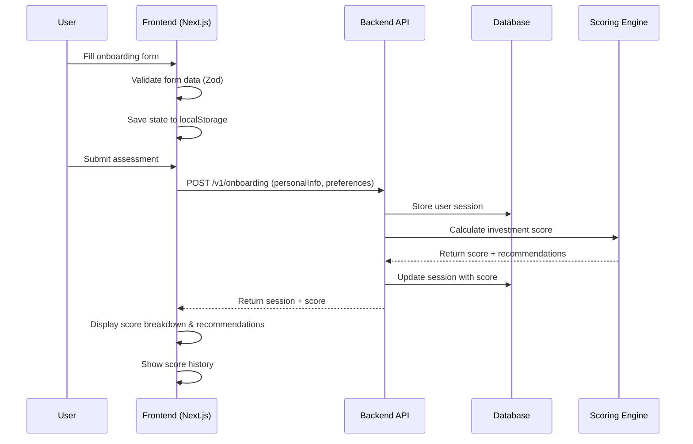

# Investment Onboarding UI + Score Viewer

A modern React/TypeScript frontend application for investment readiness assessment, built with Next.js 14, Tailwind CSS, and React Query. This application provides a comprehensive onboarding experience that collects user information and displays personalized investment readiness scores.

## 🏗️ Project Architecture

### Frontend Stack
- **Framework:** Next.js 14 (App Router) + TypeScript
- **Styling:** Tailwind CSS + Radix UI components
- **State Management:** React Hook Form + React Query (TanStack Query)
- **Form Validation:** Zod schemas
- **HTTP Client:** Axios
- **Testing:** Vitest + React Testing Library
- **Icons:** Lucide React

### Architecture Flow



## 🚀 Features

### 📝 **3-Step Onboarding Process**

**Step 1: Basic Information**
- Age (18-100)
- Annual Income
- Employment Status (Full-time, Part-time, Self-employed, Unemployed, Retired)
- Education Level (High School, Bachelor's, Master's, PhD, Other)

**Step 2: Investment Preferences** 
- Risk Tolerance (Low, Moderate, High)
- Investment Goals (Multiple selection: Retirement, Wealth Building, Income, Education, Emergency Fund, Other)
- Time Horizon (Short-term 1-3 years, Medium-term 3-10 years, Long-term 10+ years)

**Step 3: Review & Submit**
- Review all entered information
- Submit for assessment
- Receive personalized investment readiness score

### 📊 **Score Display & Analytics**

**Investment Readiness Score (0-100)**
- Visual circular progress indicator
- Color-coded score ranges (Low: Red, Medium: Yellow, High: Green)
- Detailed score breakdown by category

**Score Components**
- Personal Information Analysis
- Risk Assessment
- Investment Goal Alignment
- Time Horizon Suitability

**Recommendations**
- Personalized investment advice
- Action items for improvement
- Educational resources

### 📈 **Session History & Tracking**

**Recent Sessions**
- View past assessment scores
- Track progress over time
- Session details (Date, Score, Session ID)
- User-specific history

**Data Persistence**
- Client-side form state saving (localStorage)
- Resume incomplete assessments
- Reset functionality

### 🎨 **UI/UX Features**

**Responsive Design**
- Mobile-first approach
- Adaptive layouts for all screen sizes
- Touch-friendly interactions

**Accessibility**
- ARIA labels and roles
- Keyboard navigation support
- Screen reader compatibility
- Focus management

**User Experience**
- Step-by-step progress indicator
- Form validation with helpful error messages
- Loading states and feedback
- Smooth transitions and animations

## 🛠️ Setup & Development

### Prerequisites

- Node.js 18+ 
- npm or yarn
- Running backend API

### Installation

1. **Clone the repository:**
   ```bash
   git clone https://github.com/mengeshaster/onboarding-ui-score-viewer.git
   cd onboarding-ui-score-viewer
   ```

2. **Install dependencies:**
   ```bash
   npm install
   # or
   yarn install
   ```

3. **Environment Configuration:**
   ```bash
   cp .env.local.example .env.local
   ```

   Configure environment variables in `.env.local`:
   ```env
   NEXT_PUBLIC_API_BASE_URL=http://localhost:3000
   NEXT_PUBLIC_API_KEY=your-api-key
   ```

4. **Start development server:**
   ```bash
   npm run dev
   ```

   Visit [http://localhost:3000](http://localhost:3000)

### Available Scripts

- `npm run dev` - Start development server
- `npm run build` - Build for production  
- `npm run start` - Start production server
- `npm run lint` - Run ESLint
- `npm run test` - Run test suite
- `npm run test:watch` - Run tests in watch mode
- `npm run format` - Format code with Prettier

## 📁 Project Structure

```
onboarding-ui-score-viewer/
├── public/                    # Static assets
├── src/
│   ├── app/                   # Next.js App Router pages
│   │   ├── layout.tsx         # Root layout with providers
│   │   ├── page.tsx           # Homepage
│   │   ├── onboarding/        # Onboarding page
│   │   └── globals.css        # Global styles
│   ├── components/            # React components
│   │   ├── onboarding/        # Onboarding flow components
│   │   │   ├── onboarding-form.tsx
│   │   │   ├── step-indicator.tsx
│   │   │   └── steps/         # Individual form steps
│   │   │       ├── basic-info-step.tsx
│   │   │       ├── preferences-step.tsx
│   │   │       └── review-step.tsx
│   │   ├── score/             # Score display components
│   │   │   ├── score-display.tsx
│   │   │   ├── score-breakdown.tsx
│   │   │   ├── recommendations.tsx
│   │   │   ├── score-history.tsx
│   │   │   └── circular-progress.tsx
│   │   ├── ui/                # Reusable UI components
│   │   │   ├── button.tsx
│   │   │   ├── card.tsx
│   │   │   ├── input.tsx
│   │   │   ├── select.tsx
│   │   │   └── ...
│   │   └── providers/         # React context providers
│   │       └── providers.tsx
│   ├── lib/                   # Utilities and configurations
│   │   ├── api/               # API layer
│   │   │   ├── client.ts      # Axios configuration
│   │   │   └── endpoints.ts   # API endpoints
│   │   ├── hooks/             # Custom React hooks
│   │   │   └── api.ts         # API hooks using React Query
│   │   ├── types/             # TypeScript type definitions
│   │   │   └── api.ts         # API response types
│   │   ├── validations/       # Zod validation schemas
│   │   │   └── onboarding.ts  # Form validation
│   │   └── utils.ts           # Utility functions
│   └── test/                  # Test files
│       └── setup.ts           # Test configuration
├── package.json
├── tsconfig.json
├── tailwind.config.ts
├── next.config.js
├── vitest.config.ts
└── ...
```

## 🔧 API Integration

### API Endpoints

**Onboarding Submission**
```typescript
POST /v1/onboarding
{
  userId: string,
  rawInput: {
    personalInfo: {
      age: number,
      income: number,
      employment: string,
      education: string
    },
    preferences: {
      riskTolerance: string,
      investmentGoals: string[],
      timeHorizon: string
    },
    flags: string[]
  }
}
```

**Session History**
```typescript
GET /v1/onboarding/recent/:userId
Response: {
  id: string,
  createdAt: string,
  score: number,
  scoreExplanation: string
}[]
```

### Data Models

**OnboardingFormData**
```typescript
interface OnboardingFormData {
  age: number
  income: number
  employment: 'full-time' | 'part-time' | 'unemployed' | 'self-employed' | 'retired'
  education: 'high-school' | 'bachelors' | 'masters' | 'phd' | 'other'
  riskTolerance: 'low' | 'moderate' | 'high'
  investmentGoals: string[]
  timeHorizon: 'short' | 'medium' | 'long'
  flags: string[]
  userId?: string
}
```

## 🧪 Testing

### Test Suite Includes
- Component rendering tests
- Form validation testing
- API integration mocking
- User interaction testing
- Accessibility testing

### Running Tests
```bash
# Run all tests
npm run test

# Watch mode
npm run test:watch

# UI mode
npm run test:ui
```

## 📱 Mobile Responsiveness

The application is built with a mobile-first approach:

- **Breakpoints:** Tailwind CSS responsive classes (sm, md, lg, xl)
- **Touch-friendly:** Larger tap targets and spacing on mobile
- **Adaptive Layout:** Step indicators and forms adjust to screen size
- **Performance:** Optimized for mobile devices

## 🔒 Data Privacy & Storage

**Client-Side Storage**
- Form data temporarily stored in localStorage
- Data cleared after successful submission
- No sensitive data persisted long-term

**Security Considerations**
- Form validation on both client and server
- API key authentication
- HTTPS in production
- Input sanitization

## 🚀 Deployment

### Build Process
```bash
npm run build
npm run start
```

### Environment Variables (Production)
```env
NEXT_PUBLIC_API_BASE_URL=https://your-api-domain.com
NEXT_PUBLIC_API_KEY=production-api-key
```

### Deployment Platforms
- **Vercel:** Optimized for Next.js applications
- **Netlify:** Static site hosting with serverless functions
- **Docker:** Containerized deployment
- **Traditional hosting:** Build static files

## 🤝 Contributing

1. Fork the repository
2. Create a feature branch (`git checkout -b feature/amazing-feature`)
3. Make your changes
4. Add tests for new functionality
5. Ensure all tests pass (`npm run test`)
6. Run linting (`npm run lint`)
7. Commit your changes (`git commit -m 'Add amazing feature'`)
8. Push to the branch (`git push origin feature/amazing-feature`)
9. Open a Pull Request

## 📄 License

MIT License - see [LICENSE](LICENSE) file for details.

## 🔗 Related Projects

- [Investment Scoring API](https://github.com/mengeshaster/onboarding-ui-score-viewer.git) - Backend API and scoring engine
- [Score Analytics Dashboard](https://github.com/mengeshaster/modular-onboarding-scoring.git) - Admin dashboard for score analysis